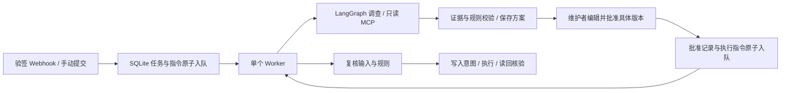

# Issue Agent v0.2：为维护者整理工单信息与审阅追问

面向有人工审阅需求的小型研发团队：接收 GitHub Issue 事件，按仓库规则读取正文和评论，给出逐字段证据、信息缺口和有限动作草稿。维护者可以编辑、批准或拒绝；发布前重新检查输入，发布后读回核验。

这是个人工程项目，目前没有生产用户或节省工时的实测证明。2026-10-08 本机验证：**49 项测试通过，40 个离线场景通过**。真实 DeepSeek 在两个公开快照上的单次阅读与 Agent 调查已跑通；没有人工金标准，不能报告准确率或效果提升。详见 [升级验收报告](docs/upgrade-verification-2026-10-08.md)。

## 快速运行

在包含 `pyproject.toml` 的 `issue-agent` 根目录执行：

```powershell
python -m venv .venv
.\.venv\Scripts\python.exe -m pip install -r requirements-dev.lock
.\.venv\Scripts\python.exe -m pip install --no-deps --no-build-isolation -e .
# 首次使用才复制；已有 .env 时不要覆盖。
Copy-Item .env.example .env
.\.venv\Scripts\python.exe -m uvicorn issue_agent.api:create_app --factory --host 127.0.0.1 --port 8000
```

打开 http://127.0.0.1:8000 。默认完全离线；Issue #1 信息齐全，#2 缺少信息，#3 功能建议，#4 含不可信指令。勾选起草动作后提交 #2，等待审阅，编辑评论并保存为新版本，再批准。演示中的评论和标签只写本地 fixture 数据库。

Linux/macOS 使用 `.venv/bin/python`。Python 3.13 是已验证的本机版本。

## 这次升级解决了什么

| 原来的限制 | v0.2 行为 |
|---|---|
| HTTP 请求一直等模型完成 | 返回 202 和任务 ID；持久队列异步执行 |
| 只能手动输入编号 | 验签的 GitHub Webhook 接入，重复 delivery 去重 |
| 固定字段和标签 | 维护者配置 TOML 仓库规则，默认仍检查四项 Bug 信息 |
| 批准后内容可能已变化 | 摘要绑定任务、方案版本、输入快照、规则及动作；执行前重读 |
| 草稿不能编辑 | 编辑生成不可变新版本，旧摘要失效 |
| 新评论到来仍可能追问旧问题 | 新事件使待审方案失效并发起新调查；执行前再次核对 |
| 只有整段报告 | 逐字段展示 present/missing/insufficient/conflicting 和原文证据 |
| 重启后需要手动找到任务 | 可查询任务列表，队列恢复；不确定写入保持待核对 |

## 核心流程



API 只存业务指令；运行时图只有一个 Worker 所有者。OS 文件锁阻止同一数据目录的两个 Worker 同时运行。默认本地服务内嵌 Worker，也可使用独立进程：API 设置 `IA_EMBEDDED_WORKER=false`，另运行 `python -m issue_agent.worker`。

这是一种**单机、串行执行架构**，不能当作多节点分布式队列。SQLite 放本机磁盘；不要放共享网络文件系统。`/health` 表示 API 可响应，不代表独立 Worker 或上游模型健康。

## 配置 GitHub 和 DeepSeek

仅在本地 `.env` 中配置密钥，不能提交 Git：

```dotenv
IA_MODEL_MODE=deepseek
IA_DEEPSEEK_API_KEY=your-local-key
IA_DEEPSEEK_MODEL=deepseek-flash
IA_TOOL_MODE=github
IA_REPOSITORY=Shahuang123269/-1
IA_GITHUB_TOKEN=your-repository-scoped-write-token
IA_GITHUB_READ_TOKEN=your-separate-read-only-token
IA_ALLOW_REMOTE_WRITES=false
IA_API_TOKEN=your-workbench-token
IA_WEBHOOK_SECRET=your-webhook-secret
IA_POLICY_PATH=policy.example.toml
```

模型名以你的 DeepSeek 账号实际可用模型为准。先只读联调，再启用 `IA_ALLOW_REMOTE_WRITES=true`；此开关仍不能替代人工审批。模型调用可能收费。

如果本机系统代理导致模型连接失败，可在此项目 `.env` 设置 `IA_HTTP_TRUST_ENV=false`，仅让模型客户端不沿用系统代理及环境证书设置，仍保留 TLS 校验；这不会修改系统代理。需要企业代理或自定义 CA 的环境应保持 true。

独立只读 token 会传入 MCP 子进程；没有配置时回退到现有 GitHub token。**回退模式不构成凭据隔离**。Compose 将模型和 GitHub 密钥从 API 容器的有效环境变量中清空，Worker 保有执行所需凭据。Worker 主进程尚未做容器内网络沙箱。

Webhook URL 为部署后的 HTTPS `/webhooks/github`，Content type 为 JSON，Secret 与 `IA_WEBHOOK_SECRET` 一致。订阅 Issues 和 Issue comments。支持 opened/edited/reopened，以及评论 created/edited/deleted；过滤 PR、Bot 和本系统已知评论输出。只接受配置仓库；没有 secret 或使用 fixture 模式时不处理真实事件。公网部署仍需 HTTPS、入口流量限制和访问控制。

使用 `policy.example.toml` 配置必要字段、标签白名单、语义标签映射、追问前缀和事件是否起草动作。规则属于维护者配置，不读取 Issue 中要求修改权限的文字。

## API

| 接口 | 行为 |
|---|---|
| `POST /tasks` | 202 接收任务，支持 `Idempotency-Key` |
| `GET /tasks?limit=20&before=...&status=...` | 任务列表和游标分页 |
| `GET /tasks/{id}` | 状态、当前方案、版本、核验结果 |
| `POST /tasks/{id}/plan` | 提交当前 digest 和新 actions，生成新版本 |
| `GET /tasks/{id}/plans` | 不可变方案和审批历史 |
| `POST /tasks/{id}/approval` | digest 与 approve/reject，202 原子入队 |
| `POST /tasks/{id}/resume` | 对中断或待核对任务请求恢复 |
| `GET /tasks/{id}/events`、`/stream` | 审计事件及 SSE |
| `GET /queue` | 队列计数；需要工作台身份认证 |
| `POST /webhooks/github` | 独立 HMAC 验签入口 |

202 仅表示已接收。等待 `awaiting_approval` 审阅；`completed` 才表示任务流程结束。`needs_review` 需要重新调查；`reconciliation_needed` 表示写入结果不确定，不能直接重发。队列满返回 503，同一提交键重试不会重复创建任务。

## 验证与评测

```powershell
.\.venv\Scripts\python.exe -m ruff check .
.\.venv\Scripts\python.exe -m pytest -q
.\.venv\Scripts\python.exe -m issue_agent.evaluate --report reports/local-fixture.json
# 真实模型 + 已采集的公开快照，只读、会产生调用费用：
.\.venv\Scripts\python.exe -m issue_agent.benchmark --model deepseek --methods rules single agent --limit 2
```

若系统临时目录权限异常，按 [验收报告](docs/upgrade-verification-2026-10-08.md) 使用项目内独立临时目录；不必修改系统 Python 权限。

对照评测比较标题匹配规则、单次模型阅读、Agent 多次工具调查。固定输入快照、时间边界、模型标识和提示词哈希，记录调用量与耗时；单次基线与 Agent 的调用预算不同，不能宣称严格等成本对比。没有人工金标准时评分为 null，不输出“准确率”。如何补齐独立数据与真实试用，见 [评测及试用验收](docs/pilot-evaluation.md)。

## 部署与升级

`docker compose up --build -d` 启动 API 和 Worker，两者共享任务卷与只读规则文件。先配置 `.env` 的 API token。API 绑定本机 8000 端口。仓库 CI 验证 Windows/Linux、离线回归和 Docker；实际执行结果以验收报告和 Actions 为准。

v0.2 增量创建 plans、decisions、jobs、deliveries、workflow_meta 表，不删除旧任务或旧审批。升级前停止旧进程并备份整个 data 目录。旧版没有输入快照的待审任务保留可查询，但必须重新调查，不能直接沿用批准。`/tasks` 从同步 201 改为异步 202，旧客户端需要轮询或 SSE；已更新 foundation_lab.py。

## 开源参考与项目边界

主要设计参考 [github/gh-aw](https://github.com/github/gh-aw)：事件接入、仓库规则、只读分析和受控输出。2026-10-08 查询为 5,356 Stars，MIT；固定参考 commit `bc3991ee9b06be7532722548675955d8165ab6db`。本项目独立实现 Python 服务，**没有继承 gh-aw 的运行时、沙箱或生产验证**。详情见 [来源说明](THIRD_PARTY_NOTICES.md)。运行依赖仍包括 LangGraph 和官方 MCP SDK。

限制：单 owner 身份、单机串行、尚无真实用户试用；引用存在性校验不等于语义正确；读回确认不等于跨系统事务；重读与远端写入之间仍有竞争窗口。暂未自动判断重复工单、修改代码或自动关闭 Issue。

学习入口：[v0.2 结构与面试问题](docs/architecture-v2.md)。旧版历史报告保留在 docs 中，其测试结果和同步接口描述不能当作当前版本验证。
