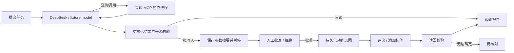

# 研发 Issue 协作 Agent

将 Day 1–10 学习 demo 升级为可核验的研发任务系统：围绕指定 GitHub Issue 调查信息、给出引用原文的建议、起草有限操作，批准后执行评论/标签并读回核验。

使用 Python、LangGraph、独立 stdio MCP、FastAPI、SQLite，支持 DeepSeek。默认提供**完全离线的模型与业务系统替身**，用于演示和故障复现；替身结果不能作为模型准确率。

本机验证：29 项测试通过；40 个离线回归通过。真实 `deepseek-flash` 在同一 40 例开发集上，执行检查 40/40，字段与分类严格检查 38/40。工具仍为模拟业务系统，数据集用于开发调试，不能据此宣称真实工单准确率。原始报告与两例问题分析见 [验证记录](docs/verification.md) 和 [联调分析](docs/deepseek-analysis.md)。

了解每项功能的完成状态、测试断言和未验证范围，阅读 [2026-10-02 测试报告](docs/test-report-2026-10-02.md)；学习目录、调用链和各模块核心代码，阅读 [整体结构与核心代码解读](docs/code-guide.md)。

公开工单候选、只读采集和标注方法见 [真实数据起步](docs/real-data-starter.md)；从运行到排错、修改和面试解释的练习见 [项目掌握练习](docs/study-lab.md)。

## 快速运行

Python 3.13 为当前验证环境。Windows PowerShell：

```powershell
python -m venv .venv
.\.venv\Scripts\python.exe -m pip install -r requirements-dev.lock
.\.venv\Scripts\python.exe -m pip install --no-deps --no-build-isolation -e .
Copy-Item .env.example .env
.\.venv\Scripts\python.exe -m issue_agent.demo
.\.venv\Scripts\python.exe -m uvicorn issue_agent.api:create_app --factory --host 127.0.0.1 --port 8000
```

打开 `http://127.0.0.1:8000`。离线 Issue #1 信息齐全，#2 信息不足，#3 功能建议，#4 含不可信指令。

Linux/macOS 将 Python 路径替换为 `.venv/bin/python`。`requirements.lock` 为运行依赖，`requirements-dev.lock` 额外包含检查工具；二者锁定实际验证版本。

## 切换 DeepSeek 和 GitHub

编辑本地 `.env`：

```dotenv
IA_MODEL_MODE=deepseek
IA_DEEPSEEK_API_KEY=填写你自己的密钥
IA_DEEPSEEK_MODEL=deepseek-flash
IA_DEEPSEEK_BASE_URL=https://api.deepseek.com
IA_TOOL_MODE=github
IA_REPOSITORY=Shahuang123269/-1
IA_GITHUB_TOKEN=填写仅对演示仓库授权的token
IA_ALLOW_REMOTE_WRITES=false
```

真实模型调用产生费用。密钥仅保存在本地环境，禁止提交 `.env`。先使用只读任务验证模型与 GitHub 连接，再启用 `IA_ALLOW_REMOTE_WRITES=true`；写入还必须经过针对具体 action digest 的人工审批。仓库需要已有 Issue；项目不自动创建演示工单。

DeepSeek 当前官方模型名及工具调用以 [官方文档](https://api-docs.deepseek.com/) 为准。本版本使用非思考模式和本地 Pydantic 校验，未启用 beta strict，配置允许后续更换模型。

## 可复现检查

```powershell
.\.venv\Scripts\python.exe -m ruff check .
.\.venv\Scripts\python.exe -m pytest -q
.\.venv\Scripts\python.exe -m issue_agent.evaluate --report reports/local-fixture.json
# 本地配置密钥后：实际 DeepSeek + 固定业务替身，需要付费
.\.venv\Scripts\python.exe -m issue_agent.evaluate --model deepseek --report reports/local-deepseek.json
```

40 个固定逻辑案例：30 个调查任务、10 个审批/执行任务。报告区分控制检查通过、业务目标完成、拒绝、待核对；拒绝后无副作用不能计作写入目标完成。程序检查字段、来源引用、参数、动作数和最终状态，建议质量另需人工评分。参见 [评测规则](docs/evaluation.md)。

## 核心机制



- LangGraph checkpoint 保存执行位置，SQLite 业务表保存任务、审批、动作和事件，两者职责不同。
- MCP 子进程只暴露读取工具；模型不能调用写入或扩大仓库范围。
- 根据任务权限约束输出 Schema；引用或结构不合法时最多反馈修正两次，权限错误直接终止。
- 审批摘要绑定仓库、Issue 编号、动作类型和完整参数，修改参数会改变摘要。
- 评论使用 operation marker；重启后先核对远端。无法确认结果时停止自动重试。
- 添加标签保留原有标签，核验目标状态；状态已存在不代表是本任务造成的。
- 单进程串行执行器，限制模型次数、工具次数、上下文大小与单次请求超时。
- 事件记录调用数量、耗时、token usage 和错误代码；不记录凭据及原始供应商异常。

## API 与部署

`POST /tasks` 创建并执行到调查结束或审批暂停；`GET /tasks/{id}` 查询；`POST /tasks/{id}/approval` 审批；`POST /tasks/{id}/resume` 核对并恢复；`GET /tasks/{id}/events` 读取事件；`GET /tasks/{id}/stream` 为支持 Last-Event-ID 的 SSE；`GET /health` 检查配置模式。OpenAPI 见启动后的 `/docs`。

提交任务可带 `Idempotency-Key` 请求头；相同键和请求返回原任务，避免重复推理和创建动作；同键不同内容拒绝。省略该键代表主动创建新任务，不能依赖正文相同来防止重复评论。

V1 创建请求会等待调查完成，尚未引入后台队列。只支持一个服务进程/一个执行器，不可启动多个 uvicorn worker。默认限制本机访问；跨机器访问需要 `IA_API_TOKEN`、HTTPS 及部署访问控制。身份目前是单一 owner，没有组织 RBAC。

提供 Dockerfile、Compose 与 Windows/Linux GitHub Actions 配置；各环境的实际运行状态以 [验证记录](docs/verification.md) 为准。Compose 绑定本机端口并使用持久卷，启动前须在 .env 设置 IA_API_TOKEN，供容器网络中的 API 认证；工作台可以填写该 token。

## 开源借鉴与个人工作边界

运行时直接复用 [LangGraph](https://github.com/langchain-ai/langgraph) 和 [官方 MCP SDK](https://github.com/modelcontextprotocol/python-sdk)；参考 [Open SWE](https://github.com/langchain-ai/open-swe) 的研发任务分层，[Deep Agents](https://github.com/langchain-ai/deepagents) 的工具与人工审批机制。不是重命名整套开源应用。选择依据、star 快照、固定参考 commit 和许可证见 [开源调研](docs/open-source-research.md) 与 [来源说明](THIRD_PARTY_NOTICES.md)。

本项目新增的是 Issue 业务建模、目标范围限制、审批参数一致性、外部副作用恢复、连接器、固定评测集和展示接口。图引擎、checkpoint 和 MCP 协议能力属于开源依赖，简历应如实注明“基于”。

学习源代码保存在 `examples/original-demo`，工程版本使用独立入口。简历草稿与面试题见 [STAR 与证据](docs/resume-star.md)。
