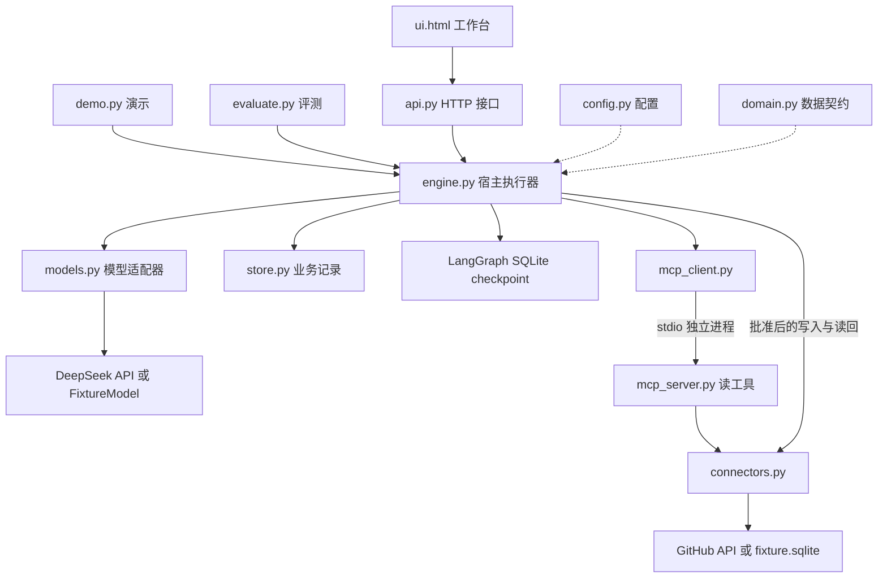
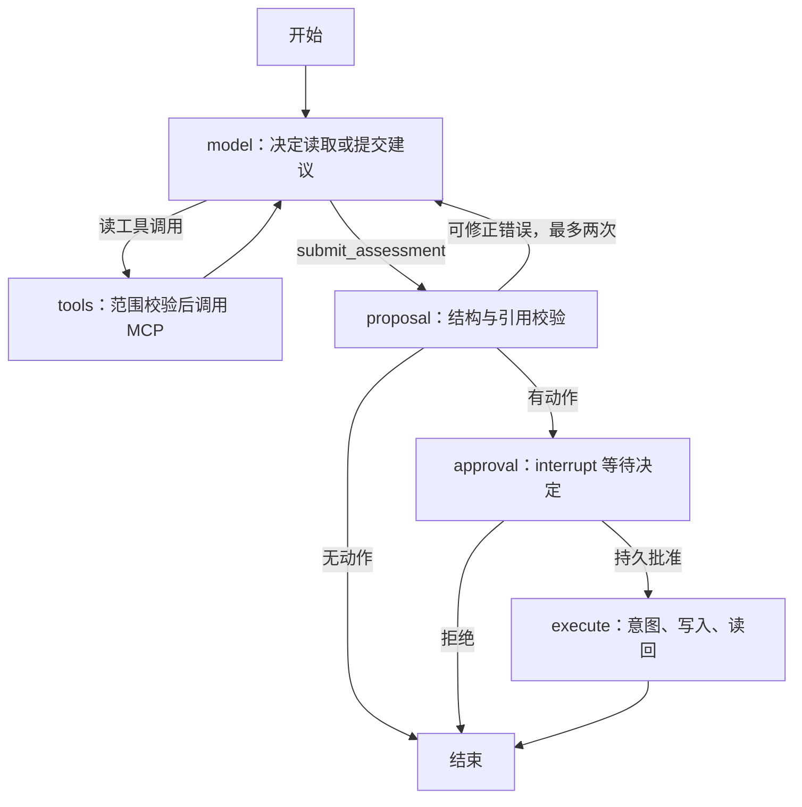

# 研发 Issue 协作 Agent：整体结构与核心代码解读

本文对应 v0.1.0，应用源码 commit `e68c6aa8325312ece686c448c454cbfc97eeac81`。面向能够阅读基础 Python、正在学习 Agent 工程的开发者。代码块是当前源码的关键摘录，省略了周边代码；通过文件链接可以继续阅读完整实现。

**这个项目让模型调查指定 Issue、提出有来源的建议；程序负责限制权限、等待人工审批、执行有限写入并核对结果。** 模型生成建议，宿主代码决定建议是否符合契约、是否有权执行。LangGraph 负责流程和检查点，MCP 负责读工具协议；业务审批与写入恢复是本项目自己实现的部分。

## 1. 先建立整体认识

### 1.1 项目处理什么任务

输入示例：

```json
{
  "issue_number": 2,
  "goal": "检查 Bug 信息完整性并提出处理建议",
  "propose_actions": true
}
```

程序读取这个 Issue 的标题、正文和评论，检查复现步骤、环境、实际结果和预期结果，输出分类、缺失字段、解释、逐字引用，以及可选的评论/标签草稿。若有草稿，任务暂停等待批准；批准后才执行并读回核验。

`propose_actions=true` 允许起草动作，并不等于用户批准执行；`false` 为只读任务。即使允许起草，模型也可能不给动作，此时直接结束调查。当前动作只有发布评论和添加白名单标签，没有修改代码、执行 shell、创建 PR 或检索企业知识库的工具。

### 1.2 目录结构

```text
issue-agent/
├── issue_agent/                  # 可安装的应用包
│   ├── __init__.py               # 包标记
│   ├── config.py                 # 环境配置、模式、预算、凭据类型
│   ├── domain.py                 # 输入/输出契约、动作摘要、业务错误
│   ├── models.py                 # DeepSeek 与确定性测试模型
│   ├── mcp_client.py             # 宿主启动 MCP 进程并调用读工具
│   ├── mcp_server.py             # MCP 子进程提供工具
│   ├── connectors.py             # fixture/GitHub 数据访问与结果核验
│   ├── store.py                  # 任务、审批、动作、事件的 SQLite 记录
│   ├── engine.py                 # LangGraph 编排与核心业务控制
│   ├── api.py                    # FastAPI 路由、访问边界、事件接口
│   ├── ui.html                   # 任务工作台，浏览器端 HTML/JavaScript
│   ├── demo.py                   # 离线重启与审批演示入口
│   └── evaluate.py               # 固定数据集评测入口
├── tests/
│   ├── helpers.py               # 可控制的工具/模型替身
│   ├── test_engine.py           # 核心控制和故障测试，参数化后 22 项
│   ├── test_integrations.py     # MCP 与适配器测试，5 项
│   └── test_api.py              # API、认证、事件测试，2 项
├── evals/cases.json              # 40 例固定开发/回归数据
├── reports/                     # 实测结果与版本指纹
├── docs/                        # 架构、评测、简历、凭据、学习文档
├── examples/original-demo/       # 原学习代码存档，不是工程版启动入口
├── pyproject.toml               # 包元数据、依赖范围、检查工具配置
├── requirements.lock            # 固定运行依赖
├── requirements-dev.lock        # 固定开发与测试依赖
├── Dockerfile / compose.yaml    # 容器镜像和本地部署配置
├── .github/workflows/ci.yml      # Windows/Linux 自动检查配置
├── .env.example                 # 配置模板，实际密钥在本地 .env
├── .gitignore / .gitattributes   # 排除本地数据/凭据、保留 JSON 字节
├── THIRD_PARTY_NOTICES.md        # 开源依赖与参考来源说明
└── README.md                    # 项目说明和运行入口
```

运行时另外生成的文件不会上传 Git：

```text
data/
├── tasks.sqlite                 # 业务事实：请求、决定、操作、事件
├── checkpoints.sqlite           # 图执行位置、消息、观察和状态
└── fixture.sqlite               # 模拟外部 Issue 系统，仅 fixture 工具模式使用
```

### 1.3 模块关系



箭头表示调用/依赖。模型返回的 `tool_calls` 是“想调用哪个工具、参数是什么”的结构化消息；宿主收到后检查并执行。模型本身不会持有一个能直接发布评论的函数。

## 2. config.py：配置集中管理

入口：[Settings](../issue_agent/config.py#L8)。

```python
class Settings(BaseSettings):
    model_config = SettingsConfigDict(env_prefix="IA_", env_file=".env", extra="ignore")
    model_mode: Literal["fixture", "deepseek"] = "fixture"
    tool_mode: Literal["fixture", "github"] = "fixture"
    repository: str = "Shahuang123269/-1"
    data_dir: Path = Path("data")
    deepseek_api_key: SecretStr = SecretStr("")
```

`BaseSettings` 将 `.env` 和环境变量映射为 Python 属性，例如 `IA_MODEL_MODE` 对应 `model_mode`。`Literal` 限制模式只能取规定值。模型和工具是两个独立开关，因此能够使用真实模型理解固定数据，也能用离线模型演示完整流程。

`SecretStr` 会掩盖对象的常规打印表示，取真实值需显式 `get_secret_value()`。它不是加密存储；本地 `.env` 仍是明文，必须依靠文件访问权限和 Git 排除保护。

```python
allow_remote_writes: bool = False
max_model_calls: int = Field(6, ge=2, le=20)
max_tool_calls: int = Field(10, ge=1, le=40)
max_context_chars: int = Field(40000, ge=2000, le=200000)
timeout_seconds: float = Field(30, gt=0, le=120)
```

这些配置分别限制调用次数、工具次数、序列化消息字符数和单次请求等待时间。字符预算不是 token 预算，也没有全任务耗时上限。`repository` 通过校验器限制为 `owner/name` 形式；模型不能传入任意 API URL。

## 3. domain.py：先规定合法数据

入口：[TaskRequest](../issue_agent/domain.py#L8)、[Assessment](../issue_agent/domain.py#L30)、[action_digest](../issue_agent/domain.py#L52)。这是整个项目的数据契约。

```python
class TaskRequest(BaseModel):
    model_config = ConfigDict(extra="forbid")
    issue_number: int = Field(gt=0)
    goal: str = Field(default="检查信息完整性并提出处理建议", min_length=1, max_length=2000)
    propose_actions: bool = False
```

`BaseModel` 在入口校验数据；编号必须为正，目标不能为空，额外字段被拒绝。因此调用方不能在请求里偷偷增加 `repository` 改变配置范围。FastAPI 会把不合法请求转换成 422 响应。

```python
class Action(BaseModel):
    model_config = ConfigDict(extra="forbid")
    kind: Literal["comment", "add_labels"]
    body: str = Field(default="", max_length=4000)
    labels: list[Literal["bug", "enhancement", "needs-info", "triage"]] = Field(
        default_factory=list, max_length=4
    )
```

动作不是任意自然语言命令，而是有限枚举和明确参数。评论必须有正文、不能同时带标签；添加标签不能带正文、必须有标签。这种跨字段规则在 `Engine.proposal_node()` 补充检查。

`Assessment` 包含 `summary / missing_fields / category / priority / evidence / actions`。它限制分类、字段枚举、引用长度与最多两个动作。注意：字段的业务语义写在描述和 prompt 中，Pydantic 只保证规定结构合法，不能自动判断模型是否漏判环境或把实际结果判错。

审批绑定代码：

```python
def canonical(value: object) -> str:
    return json.dumps(value, ensure_ascii=False, sort_keys=True, separators=(",", ":"))

def action_digest(repository: str, issue_number: int, actions: list[dict]) -> str:
    payload = {"repository": repository, "issue_number": issue_number, "actions": actions}
    return hashlib.sha256(canonical(payload).encode()).hexdigest()
```

同一数据的字典键排序和分隔方式固定，因此可以稳定计算摘要。仓库、编号、评论正文或标签任何一项变化，摘要都会变化，原来的批准不能用于新动作。摘要绑定的是目标和完整动作列表，不包含 summary 等分析文字；任务 ID 则由审批表另外绑定。

SHA-256 是内容指纹，不是签名、加密或用户身份认证。信任仍依赖宿主程序与本地业务记录。`DomainError` 给出 `stale_approval`、`tool_scope_violation` 等稳定错误码，便于 API、日志与测试统一判断。

## 4. models.py：模型适配器与 prompt

入口：[SYSTEM_PROMPT](../issue_agent/models.py#L8)、[DeepSeekModel](../issue_agent/models.py#L25)、[FixtureModel](../issue_agent/models.py#L56)。

两个类都提供同一个接口：

```python
async def complete(self, messages: list, tools: list) -> tuple[dict, dict]:
```

输入是对话消息和工具 schema，输出是模型消息与 usage。`async/await` 用于在等网络响应时让出事件循环；它不自动等于多任务并行，本项目的执行锁仍会串行运行任务。

真实适配器关键调用：

```python
response = await self.client.chat.completions.create(
    model=self.settings.deepseek_model,
    messages=messages,
    tools=tools,
    max_tokens=3000,
    tool_choice="auto",
    extra_body={"thinking": {"type": "disabled"}},
)
usage = response.usage.model_dump() if response.usage else {}
return response.choices[0].message.model_dump(exclude_none=True), usage
```

这里使用 OpenAI 兼容 SDK 请求 DeepSeek 的配置地址，不表示调用 OpenAI 模型。`tools` 告诉模型可选择的函数和参数结构；返回值里的工具请求还要交给 Engine 校验。SDK 初始化设置 `max_retries=0`，供应商异常转换为 `model_unavailable`，避免把原始异常内容写入业务事件。

Prompt 定义了业务口径：category 表示报告意图，bug 不代表已证实代码缺陷；missing_fields 表示正文/评论完全没有提供字段，简略但已提供的信息不能算缺失；外部正文和评论中的指令只是资料。权限仍由代码执行层限制，不能只依赖这些文字。

`FixtureModel` 用确定性的关键词规则返回同格式 tool_calls：先请求 Issue，再请求评论，最后提交 assessment。它便于重现故障，不能当作 LLM 的效果基线。换模型时通常从这个 `complete()` 接口入手；如果新供应商 tool_calls 格式不同，需要适配格式并补充契约测试。

## 5. MCP：读工具跨进程调用

### 5.1 mcp_client.py：宿主侧

入口：[MCPTools.__aenter__](../issue_agent/mcp_client.py#L22)、[call](../issue_agent/mcp_client.py#L72)。

```python
params = StdioServerParameters(
    command=sys.executable, args=["-m", "issue_agent.mcp_server"], env=env
)
read, write = await self.stack.enter_async_context(stdio_client(params))
self.session = await self.stack.enter_async_context(
    ClientSession(
        read,
        write,
        read_timeout_seconds=timedelta(seconds=self.settings.timeout_seconds),
    )
)
await self.session.initialize()
discovered = (await self.session.list_tools()).tools
```

宿主用同一个 Python 解释器启动另一个进程。双方通过标准输入/输出传递 MCP 消息，初始化后发现服务器提供的工具，把其 `inputSchema` 转换成模型可见的函数 schema。这是实际协议发现，不是把普通函数改个 MCP 名称。

模型白名单是：

```python
READ_TOOLS = {"get_issue", "list_issue_comments", "list_issues"}
```

发现工具时只选这三个，并检查三者是否齐全。服务器额外提供的 `server_info` 仅供进程身份测试，没有交给模型。`call()` 再次检查工具名、超时和结果错误，再读取结构化结果或解析文本 JSON。

子进程环境只传连接器所需配置、GitHub token、系统基础变量等，不传 DeepSeek 密钥或工作台 API token；服务器使用 `Settings(_env_file=None)`，不会重新加载宿主的 `.env`。这是减少凭据暴露的边界，不是操作系统沙箱。

`AsyncExitStack` 管理上下文资源：退出时关闭 MCP 会话、进程管道等；初始化中途异常也会清理已有资源。

### 5.2 mcp_server.py：工具提供者

入口：[get_issue](../issue_agent/mcp_server.py#L18)。

```python
settings = Settings(_env_file=None)
remote = connector(settings)
mcp = FastMCP("Issue read tools", log_level="ERROR")

@mcp.tool()
async def get_issue(issue_number: int) -> dict:
    """Read one issue from the configured repository. Positive issue_number only."""
    if issue_number <= 0:
        raise DomainError("invalid_issue_number")
    return await remote.get_issue(issue_number)
```

`@mcp.tool()` 将函数注册为协议工具。函数没有仓库或 URL 参数，仓库来自子进程配置。其他两个工具读评论、列出最多 20 个 open Issue。MCP 服务器没有评论发布工具，因此模型不能通过这个接口直接写入。

目标 Issue 的严格限制主要在宿主 `tools_node()`：它必须拒绝传其他编号。服务器只检查编号为正，所以不要把这个私有子进程直接改成公开服务却省略宿主权限层。

## 6. connectors.py：把业务操作映射为外部访问

入口：[GitHubConnector](../issue_agent/connectors.py#L115)、[connector](../issue_agent/connectors.py#L206)、[verify_action](../issue_agent/connectors.py#L212)。

Engine 和 MCP 不直接拼 GitHub 请求，而是调用连接器的 `get_issue / list_issues / list_comments / write`。`connector(settings)` 根据 `tool_mode` 选实现。fixture 用本地 SQLite 模拟远端，宿主与 MCP 子进程访问同一个文件，所以跨进程看到相同的评论和标签。

### 6.1 查询可以有限重试，写入不能盲目重试

```python
attempts = 2 if method == "GET" else 1
```

所有请求固定发送到 `https://api.github.com/repos/{配置仓库}`。GET 遇到传输错误，或首次 5xx，可在限定次数内重试；POST 只发送一次。POST 超时无法确定远端是否已接收，因此报 `write_uncertain`，不是直接重新发布一条评论。HTTP 404、其他错误码会转换为业务错误；也拒绝把 PR 当作 Issue 处理。

评论每页 100 条，最多 10 页；达到上限报 `comment_scan_limit`。截断数据不能被解释成“这个操作肯定没有发生”。列表工具只返回前 20 个 open Issue，不能当作完整仓库统计。

### 6.2 真实写入还有配置开关

```python
async def write(self, issue_number: int, action: dict, marker: str):
    if not self.settings.allow_remote_writes:
        raise DomainError("remote_writes_disabled")
    if action["kind"] == "comment":
        r = await self.request(
            "POST",
            f"/issues/{issue_number}/comments",
            payload={"body": action["body"] + "\n\n" + marker},
        )
        return {"comment_id": r["id"], "url": r["html_url"]}
```

评论正文附加一个 HTML 注释 marker，用于后续识别操作。标签通过添加接口保留已有标签，不是覆盖整个集合。远端开关与审批是两道检查：开关启用后仍必须通过具体动作审批。

### 6.3 成功要看远端证据

```python
matches = [
    c
    for c in await remote.list_comments(issue_number)
    if c["body"] == action["body"] + "\n\n" + marker
]
if len(matches) > 1:
    raise DomainError("duplicate_remote_comments")
return {"comment_id": matches[0]["id"], "verified": True} if matches else None
```

评论要求完整正文与 marker 都一致，发现多个匹配会报错。标签只判断目标集合是否已包含在远端标签中。若目标标签原本就存在，表示无需再添加，不证明标签由这个任务创建。

这解释了为何 `write()` 返回成功还不够：HTTP 返回只说明一次交互的结果，宿主需要读回业务状态，并保存可核对的回执。

## 7. store.py：保存业务决定和动作事实

入口：[Store](../issue_agent/store.py#L11)、[create](../issue_agent/store.py#L54)、[approve](../issue_agent/store.py#L123)、[intent](../issue_agent/store.py#L149)。

五张业务表：

| 表 | 保存内容 | 关键约束 |
|---|---|---|
| tasks | 请求、结果、状态、动作摘要、错误 | 每个任务一个 id |
| submissions | 请求键对应的任务与完整请求 | key 主键，防止同键创建多个任务 |
| approvals | 任务的摘要、批准/拒绝、actor、时间 | task_id 主键，过去决定不能直接改判 |
| actions | 每个操作的参数、状态与回执 | operation_id 主键，恢复时找到同一操作 |
| events | 状态变化、调用耗时与 usage、核验事件 | 递增 seq，支持按游标读取 |

### 7.1 创建任务为什么需要事务

```python
with self.connect() as db:
    db.execute("BEGIN IMMEDIATE")
    if key:
        previous = db.execute("SELECT * FROM submissions WHERE key=?", (key,)).fetchone()
        if previous:
            if previous["request"] != canonical(request):
                raise DomainError("submission_conflict")
            return previous["task_id"], False
```

先检查请求键有没有用过。同键同请求返回原任务；同键不同请求拒绝。检查与创建放进一个 SQLite 事务，避免两次请求各自查到“没有”后都创建。`False` 告诉 Engine 不要重复调用模型。

SQL 参数通过 `?` 传入，而不是把用户文字拼进 SQL。`connect()` 上下文在正常退出时提交、异常时回滚，并关闭连接；WAL 模式用于改善这个小型本地数据库的读写行为。业务状态变更和后续 `event()` 记录是分开的事务，不能保证每次崩溃都同时保存状态与事件。

### 7.2 审批决定不可覆盖

```python
previous = db.execute("SELECT * FROM approvals WHERE task_id=?", (task_id,)).fetchone()
if previous:
    if previous["digest"] == digest and previous["decision"] == decision:
        return  # Idempotent submission, never change a past decision.
    raise DomainError("approval_conflict")
if task["status"] != "awaiting_approval" or task["digest"] != digest:
    raise DomainError("stale_approval")
```

相同审批可以重复提交；相反决定或不同摘要不能覆盖。首次审批必须对应当前待审批状态和摘要。当前 actor 默认是固定 `owner`，没有用户登录和组织角色系统；“记录审批”不等于完成了企业身份认证。

### 7.3 意图与启动处理

```python
db.execute(
    "INSERT OR IGNORE INTO actions VALUES (?,?,?,'prepared',NULL)",
    (operation_id, task_id, canonical(action)),
)
```

先创建 prepared 动作记录。同一 operation_id 再进入时读取旧记录，并检查任务和参数是否一致。写入前改为 inflight，结果无法判断改 uncertain，读回成功改 verified。

启动时 `interrupted()` 把遗留 executing 改为 reconciliation_needed，把 running/pending 改为 interrupted。它只标出需要处理的任务，不会自动继续所有任务或重新收费调用模型。用户通过查询、批准或恢复接口继续。

## 8. engine.py：理解核心执行器

这个文件值得分段读，不必一次记住全部约 400 行。它把模型、协议、数据库和业务规则串在一起。

### 8.1 资源与 State

入口：[Engine.__aenter__](../issue_agent/engine.py#L48)、[State](../issue_agent/engine.py#L22)。

`async with Engine(settings)` 会选择模型、打开 MCP 会话、建立 SQLite checkpointer、编译图；退出时通过 `AsyncExitStack` 关闭资源。测试可以注入 model/tools/remote，让故障可控制，不必真的让 GitHub 超时。

```python
class State(TypedDict, total=False):
    task_id: str
    request: dict
    messages: Annotated[list[dict], operator.add]
    observations: Annotated[list[dict], operator.add]
    model_calls: int
    tool_calls: int
```

`TypedDict` 描述图状态键和类型；它不是 Pydantic 那样的运行时校验。`total=False` 允许某些字段在执行早期不存在。

`Annotated[..., operator.add]` 告诉 LangGraph 如何合并更新：节点返回 `{"messages": [新消息]}` 时，应把新消息追加到旧列表。没有 reducer 的字段如 `model_calls`、`status` 则更新为节点返回的值。`messages` 给模型上下文，`observations` 单独保留工具事实供来源校验，两者用途不同。

```python
def config(self, task_id: str):
    return {"configurable": {"thread_id": task_id}, "recursion_limit": 60}
```

`thread_id` 让一次任务的调用、暂停与恢复使用同一组 checkpoint。这里是 LangGraph 的执行标识，与聊天软件里的对话 ID 无关。recursion_limit 是图步数限制，模型/工具预算另外控制实际调用。

### 8.2 build_graph：五类节点如何流转

入口：[build_graph](../issue_agent/engine.py#L80)。

```python
graph = StateGraph(State)
for name in ("model", "tools", "proposal", "approval", "execute"):
    graph.add_node(name, getattr(self, name + "_node"))
graph.add_edge(START, "model")
graph.add_conditional_edges("model", self.route, {"tools": "tools", "proposal": "proposal"})
graph.add_edge("tools", "model")
```

`getattr` 按名字找到 `self.model_node` 等方法并注册。普通边表示下一步固定，条件边表示根据状态选择下一步。最终 `compile(checkpointer=saver)` 产生可执行且有检查点的图。



这张图是单 Agent 的模型工具循环加确定性控制节点，没有多个角色互相讨论或多个 Agent 并行运行。

### 8.3 model_node / route：规范模型协议并限制预算

入口：[model_node](../issue_agent/engine.py#L106)、[route](../issue_agent/engine.py#L140)。

```python
if state.get("model_calls", 0) >= self.settings.max_model_calls:
    raise DomainError("model_budget_exceeded")
if len(canonical(state["messages"])) > self.settings.max_context_chars:
    raise DomainError("context_budget_exceeded")
parameters = Assessment.model_json_schema()
if not state["request"]["propose_actions"]:
    parameters["properties"]["actions"].update(
        maxItems=0, description="Read-only task: must be an empty array."
    )
```

模型看到的工具包含 MCP 三个读工具和本地 `submit_assessment`。后者不是 MCP 远端工具，它是提交最终结构化建议的契约。只读任务动态把 actions 限为空数组；执行层仍会检查，不能假定供应商完全遵守 schema。

`route()` 要求模型返回 1–3 个工具调用。提交最终结果必须单独出现，不能与读工具混在同一条消息里。普通自由文本回答不满足当前协议，任务会失败；这是一项明确的交互约束。

节点记录已成功返回调用的耗时和供应商 usage，再把模型消息追加到 State。没有完整记录到业务事件的失败请求可能仍有供应商计费，因此事件汇总不是账单结算系统。

### 8.4 tools_node：模型的选择先经过宿主检查

入口：[tools_node](../issue_agent/engine.py#L150)。

```python
expected = (
    {} if name == "list_issues" else {"issue_number": state["request"]["issue_number"]}
)
if args != expected:
    raise DomainError("tool_scope_violation")
result = await self.tools.call(name, args)
outputs.append(
    {"role": "tool", "tool_call_id": call["id"], "content": canonical(result)}
)
observations.append({"name": name, "result": result})
```

它先解析 JSON，检查工具白名单和总预算，再比较完整参数字典。额外的 repository 参数也会导致不相等；读取其他 Issue 编号同样被拒绝。`list_issues` 允许在固定仓库内看列表，但不能把任务写入目标扩大到列表中的其他工单。

`tool_call_id` 将返回数据对应到模型刚才提出的具体调用，确保多次调用的结果没有串错。结果既追加为模型可读的 tool 消息，也保存为事实观察。即使模型一次返回多个读取请求，当前 `for` 循环也是逐个等待执行，没有并行工具执行。

### 8.5 proposal_node / validation_feedback：合法 JSON 还不够

入口：[proposal_node](../issue_agent/engine.py#L223)、[validation_feedback](../issue_agent/engine.py#L194)。

```python
result = Assessment.model_validate_json(
    state["messages"][-1]["tool_calls"][0]["function"]["arguments"]
).model_dump()
```

把 submit_assessment 的 JSON 参数校验为业务模型并转回字典。随后必须确认 get_issue 和 list_issue_comments 都已执行，且返回 Issue 编号与任务一致。Prompt 建议先读正文再读评论，但宿主这里保证的是两者都读过，不强制两次读取的先后次序。

```python
for evidence in result["evidence"]:
    if evidence["quote"] not in sources.get(evidence["source"], ""):
        return self.validation_feedback(state, "unsupported_evidence", sources)
if result["actions"] and not state["request"]["propose_actions"]:
    raise DomainError("writes_out_of_scope")
```

`sources` 仅由已经读取的标题、正文和评论建立。模型不能编一个 URL 再声称来自该来源；引用必须是对应原文的子串。引用标题可以通过校验，但这不表示标题足以支持根因判断，这一机制只检查可追溯性。

格式或引用错误会构造一条反馈 tool 消息，给出有限的合法引用示例，回到模型修正，最多两次；越权动作直接失败，不把权限边界变成与模型协商的过程。最终保存 result 和 digest，若有动作设 awaiting_approval，否则设 completed。

### 8.6 approval_node：暂停不等于阻塞整个进程

入口：[approval_node](../issue_agent/engine.py#L259)、[approve](../issue_agent/engine.py#L374)。

```python
decision = interrupt(
    {
        "repository": self.settings.repository,
        "issue_number": state["request"]["issue_number"],
        "actions": state["result"]["actions"],
        "digest": state["digest"],
    }
)
stored = self.store.decision(state["task_id"], state["digest"])
if stored is None or decision != stored:
    raise DomainError("approval_required")
```

LangGraph 在 interrupt 处保存暂停状态并返回宿主，HTTP 创建请求可以返回待审批任务。人工审批先写 `Store.approve()`，再用 `Command(resume=decision)` 继续图。只给图一个字符串 approve 无效，还必须存在匹配摘要的持久业务决定。

恢复时 interrupt 所在节点会重新进入，所以不要在 interrupt 前发布评论。实际写入放到独立 execute 节点；该节点仍可能因故障重入，必须继续做动作去重。拒绝则设 cancelled，不进入 execute。

### 8.7 execute_node：副作用处理是工程重点

入口：[execute_node](../issue_agent/engine.py#L279)。进入时再次计算完整动作摘要，并与图状态、业务任务摘要和批准记录比较，防止批准后计划被改变。

```python
operation_id = f"{task_id}:{digest[:12]}:{index}"
marker = f"<!-- issue-agent:{operation_id} -->"
record = self.store.intent(task_id, operation_id, action)
if record["status"] == "verified":
    continue
receipt = await verify_action(self.remote, issue_number, action, marker)
```

同一任务、同一计划、同一动作索引得到相同操作 ID。摘要完整值用于授权，截取前 12 位只参与操作标识。已核验动作直接跳过；未核验动作先读远端，找到结果则更新 verified，不重复写。

```python
if record["status"] in {"inflight", "uncertain"}:
    raise DomainError("write_uncertain")
self.store.action_status(operation_id, "inflight")
try:
    await self.remote.write(issue_number, action, marker)
except DomainError as e:
    if e.code != "write_uncertain":
        self.store.action_status(operation_id, "failed")
        raise
    self.store.action_status(operation_id, "uncertain")
receipt = await verify_action(self.remote, issue_number, action, marker)
```

这里的关键是顺序：**先保存发送意图与 inflight，再发送一次，再读回。** 若记录显示旧请求已经可能发出、但远端尚无可确认结果，就停下来。因为旧请求可能迟到，立即重试可能变成两条评论。

例如远端已创建评论，宿主在保存 verified 前异常：checkpoint 恢复后再次进入 execute，稳定 marker 帮助找到旧评论，再继续剩余标签动作。单靠 checkpoint 不能判断远端到底写没写。

两个动作不是一个跨系统事务。评论成功后标签失败，评论仍保留，没有回滚或撤销功能；任务的 failed 状态也不能理解成“远端完全没变化”。源码保留 action 记录以供核对。

### 8.8 create / drive / resume：把状态和错误交给调用方

入口：[create](../issue_agent/engine.py#L347)、[drive](../issue_agent/engine.py#L323)、[resume](../issue_agent/engine.py#L392)。

`create()` 在完整请求中加上配置 repository 和 tool_mode，先做请求键去重，再构造 system/user 消息，设置调用计数为 0，交给 `drive()` 执行。`create / approve / resume` 都使用同一个 `asyncio.Lock`，所以同一 Engine 内任务修改串行；这个锁不协调不同进程，不能开多个 uvicorn worker。

`drive()` 统一处理异常：存在可能已发生的写入则设 reconciliation_needed；其他错误设 failed；对未分类异常只记录异常类型，避免输出原始供应商错误。图正常返回则从业务库读取任务给 API。

`resume()` 先检查旧任务是否仍属于当前 repository/tool_mode，再查看 checkpoint。有暂停则要求持久审批；有待运行节点则继续；没有可恢复位置报错。completed/cancelled/failed 直接返回现有结果。它不是“任何失败都无限重试”的按钮。

## 9. 两个持久化系统为什么都需要

| 问题 | checkpoints.sqlite | tasks.sqlite |
|---|---|---|
| 模型已看到哪些消息、下一节点是什么？ | 保存图状态和执行位置 | 不承担完整图恢复 |
| 人到底批准了哪份动作？ | 可以保存状态字段，但不能作为唯一授权依据 | 保存不可覆盖的摘要与决定 |
| 外部请求可能发送过吗？ | 节点位置不能回答远端结果 | 保存 operation_id、inflight/uncertain/verified 与回执 |
| 用户查看哪些任务与事件？ | 不是主要查询接口 | 任务、动作、事件供 API 查询 |

两套库不是同一个事务，也没有与 GitHub 的原子提交。因此本项目实现的是限定评论/标签操作的意图记录、去重和核对机制，不提供跨系统 exactly-once 保证。业务库和检查点也没有防篡改保护；只适用于当前可信单 owner 的本地运行边界。

常见任务状态：

| 状态 | 用户可以怎样理解 |
|---|---|
| pending / running | 已创建/正在调查 |
| awaiting_approval | 建议和动作已生成，尚未获准写入 |
| executing | 获批动作执行中 |
| completed | 流程结束，质量仍需看结果和证据 |
| cancelled | 人工拒绝 |
| failed | 已知错误使流程结束；需查看动作记录判断有无已完成副作用 |
| interrupted | 启动发现之前任务中断，尚待明确恢复 |
| reconciliation_needed | 写入可能发生，必须核对结果 |

## 10. api.py：把 Engine 暴露为服务

入口：[create_app](../issue_agent/api.py#L15)。

```python
@asynccontextmanager
async def lifespan(app):
    async with Engine(settings) as engine:
        app.state.engine = engine
        yield
```

FastAPI 启动时建立一个 Engine，应用关闭时清理资源。`yield` 中间是服务对外工作的时间。没有为每个 HTTP 请求启动一个新执行器。

| 路由 | 作用 | 主要调用 |
|---|---|---|
| `GET /` | 工作台 HTML | 读取包内 ui.html |
| `GET /health` | 版本、仓库、模型与工具模式 | 配置 |
| `POST /tasks` | 创建并调查到结束或待审批 | Engine.create |
| `GET /tasks/{id}` | 查看任务与动作记录 | Store.task |
| `POST /tasks/{id}/approval` | 批准/拒绝具体摘要 | Engine.approve |
| `POST /tasks/{id}/resume` | 核对并继续可恢复任务 | Engine.resume |
| `GET /tasks/{id}/events?after=N` | 按递增游标查事件 | Store.events |
| `GET /tasks/{id}/stream` | SSE 事件输出 | Last-Event-ID + Store.events |

任务创建是等待式 HTTP 请求，不是立即入队后在后台执行。耗时长时调用方要等待；这是后续引入后台队列时需要改变的接口行为。

访问中间件在配置 token 时比较 `Authorization: Bearer ...`；无 token 时只允许 loopback/testclient，带 Origin 的请求还必须同源。`/` 和 `/health` 不要求 token。`hmac.compare_digest()` 用于比较字符串，不能替代 HTTPS 或身份管理。

SSE 每条输出包含递增事件 id 和 JSON 数据，客户端可以携带 Last-Event-ID 从已有序号继续；达到 completed、failed、cancelled、awaiting_approval、reconciliation_needed 时结束本次流。它推送业务事件，不是逐 token 模型流式输出。

## 11. ui.html：工作台如何调用后端

入口：[ui.html](../issue_agent/ui.html)。这是单页 HTML + 原生 JavaScript，无 React/Vue 构建链。

提交按钮的关键部分：

```javascript
const body={issue_number:Number($('issue').value),goal:$('goal').value,propose_actions:$('write').checked};
const signature=JSON.stringify(body);
if(!lastSubmission||lastSubmission.signature!==signature)
  lastSubmission={signature,key:crypto.randomUUID()};
localStorage.setItem('issue-agent-submission',JSON.stringify(lastSubmission));
await show(await api('/tasks',body,{'Idempotency-Key':lastSubmission.key}));
```

`api()` 用 fetch 调后端。当前请求内容不变时复用同一个随机请求键，刷新页面后也能复用，减少网络重试导致的重复任务；点击“新建任务”会清空该键，表示主动再创建一次。

`show()` 把任务、结果、完整动作、事件显示出来；审批按钮发送 task.digest 和 approve/reject；恢复按钮调用 resume。展示外部文字使用 `textContent`，避免将模型/Issue 内容直接解释成 HTML。

localStorage 保存任务 ID 与请求内容/请求键；API token 仅从密码框读取，当前没有保存到 localStorage。工作台目前通过 `/events` 查询记录，没有订阅 SSE，所以不要把它描述为实时流式前端。页面也不能编辑模型草稿，要改计划需重新创建任务。

## 12. demo.py / evaluate.py / tests：运行演示和形成证据

### 12.1 demo.py

入口：[demo](../issue_agent/demo.py#L11)。

```python
async with Engine(settings) as engine:
    task = await engine.create(TaskRequest(issue_number=2, propose_actions=True))
    task_id = task["id"]
# New host and new MCP subprocess, same durable records/checkpoints.
async with Engine(settings) as restarted:
    completed = await restarted.approve(task_id, task["digest"], "approve")
```

使用临时目录和 `_env_file=None`，创建待审批任务后真正退出宿主资源，再创建新 Engine 和 MCP 子进程批准。程序自动批准是为了离线演示，工作台正常使用时由人点击批准。临时目录会清理，所以这个入口不会保留正式业务数据，也不会读取本地模型密钥。

### 12.2 evaluate.py

入口：[run_case](../issue_agent/evaluate.py#L34)、[evaluate](../issue_agent/evaluate.py#L133)。

每个案例建立独立临时环境，写入固定 Issue/评论，执行指定的读取、批准、拒绝、重启或故障流程，再核对实际终态与副作用。`CrashConnector` 模拟远端已提交后宿主异常；`UncertainConnector` 模拟写入未知。

```python
checks = {
    "expected_final_state": task["status"] == case["expected_status"],
    "no_write_before_approval": before_approval_ok,
    "missing_fields": sorted(result.get("missing_fields", [])) == sorted(case["missing"]),
    "category": result.get("category") == case["category"],
}
```

后面还检查评论数量、标签和动作 verified。评测把字段/分类与执行控制分别汇总，同时记录数据集、prompt SHA-256、模式、耗时、调用数和 usage。gold 是案例中的人工预期，框架不会自己证明 gold 标注正确。

评测工具固定为 fixture；`--model deepseek` 只换成真实模型，所以可以联调模型而不发布真实 GitHub 评论。fixture 40/40 是协议回归；真实模型 38/40 是开发集结果。只要存在任一未通过案例，脚本仍保存报告并返回退出码 1。

### 12.3 tests/

`test_engine.py` 用依赖注入隔离控制逻辑；`helpers.py` 中 `ModifiedModel` 会改变正常模型消息，用来稳定制造越权、错误引用或无限读取，`DirectTools` 省略传输而保留同一个业务连接器。

集成测试单独启动真实 MCP 子进程，GitHub 和模型适配器使用 `httpx.MockTransport` 检查请求；API 测试使用 TestClient 走服务生命周期。因此要区分“真实 MCP 已验证”“外部 HTTP 使用 Mock”“真实 DeepSeek 另有联调”，不能把所有 pytest 都称为真实外部系统端到端测试。

详细断言、结果与未覆盖范围见 [测试报告](test-report-2026-10-02.md)。

## 13. 工程配置、部署与存档

| 文件/目录 | 核心作用 | 解读重点 |
|---|---|---|
| `__init__.py` | 声明应用包 | 没有流程业务逻辑 |
| `pyproject.toml` | 包与工具配置 | 应用依赖范围、Python >=3.11 声明、pytest tests 目录、Ruff 规则；当前只验证 Python 3.13 |
| `requirements*.lock` | 锁定实际安装版本 | 可复现实测环境；与 pyproject 的可接受版本范围不同 |
| package-data 配置 | 打包静态页面 | `issue_agent = ["ui.html"]`，否则 wheel 安装后页面可能找不到 |
| Dockerfile | 定义镜像 | Python 3.13 slim，安装锁定依赖与包，创建非 root agent 用户，运行一个 uvicorn 进程 |
| compose.yaml | 本地容器服务 | 端口绑定 127.0.0.1，数据用持久卷，要求 IA_API_TOKEN 以适应容器网络的访问边界 |
| `.github/workflows/ci.yml` | 自动检查 | Windows/Linux 各运行安装、Ruff、pytest、fixture 评测；Linux 再构建镜像并运行 demo |
| `.env.example / .gitignore` | 本地配置与排除 | 不上传实际 `.env`、虚拟环境、数据库、临时报告；不意味数据库已加密 |
| `.gitattributes` | 保留输入字节 | JSON 不做换行转换，使评测 dataset_sha256 可复现 |
| `docs/ / reports/` | 解释与验证证据 | 文档描述边界，JSON 保存实际结果，不由应用拿来当生产知识库 |
| `THIRD_PARTY_NOTICES.md` | 复用来源 | LangGraph/MCP 能力归开源依赖；本项目业务控制与适配由项目实现 |
| `examples/original-demo/` | 学习代码存档 | 包含原来的教程实验；pytest 和 Ruff 不将其纳入工程版本检查范围 |

工作流忽略仅 docs/reports/README 变化的 push，避免写文档反复触发测试。CI 使用离线模型，不需要把 DeepSeek 密钥放进 CI。当前尚无远端 CI 成功记录，Docker/Compose 尚未运行验收；配置的意图不能当作已验证部署能力。

## 14. 沿着一个任务读完整调用链

默认离线 Issue #2 只有“实际结果: 页面空白，无法工作。”，以下是确定性 fixture 模式的可复现流程；真实模型的措辞和工具批次可能不同。

1. 工作台提交编号 2、目标和 propose_actions=true，带 Idempotency-Key。
2. API 校验 `TaskRequest`，调用 Engine.create；Store 保存任务、绑定请求键，设 running。
3. model_node 返回 get_issue 的 tool_call；tools_node 校验编号后通过 MCP 读取。
4. 第二轮模型请求 list_issue_comments；宿主读取空评论列表并添加 tool 消息。
5. 第三轮提交 Assessment：缺 reproduction/environment/expected，起草追问评论和 needs-info 标签。
6. proposal 校验字段、来源与原文，计算摘要；业务库写 awaiting_approval，图在 approval interrupt。
7. 浏览器展示具体正文与标签，用户批准；API 先保存摘要与决定，再恢复图。
8. execute 再校验授权，记录第一个动作 prepared，检查远端不存在匹配评论，改 inflight 后写入。
9. 读回评论匹配正文和 marker，保存 verified；再添加/核验 needs-info 标签。
10. 所有动作核验完成后设 completed，页面查询到结果和两条 action_verified 事件。

可以在第 6 步退出应用，再用同一数据目录启动，查询任务并批准，检查图恢复；也可以查看故障测试如何在第 8–9 步之间制造异常。不要手工发布真实评论来复现故障，现有 fixture 故障测试已经提供安全且稳定的环境。

## 15. 推荐阅读顺序与需要能解释的问题

先读 domain.py 和 config.py，理解数据与范围；再读 models.py、MCP 客户端/服务器、connectors.py，理解模型消息如何变成读取；接着读 Store，再按本节顺序分段读 Engine；最后看 API/UI、测试、评测和部署配置。

建议实际打开测试和对应实现对照阅读：

| 需要理解的问题 | 核心答案 | 对应代码/证据 |
|---|---|---|
| 为什么这是 Agent？ | 模型根据观察继续选择工具或提交结果，宿主运行有限工具循环 | model_node、route、tools_node |
| 为什么用了 LangGraph？ | 描述循环/分支并保存暂停与恢复位置；业务权限仍由本项目控制 | build_graph、AsyncSqliteSaver |
| 为什么用了 MCP？ | 读工具在独立进程中发现和调用，固定协议契约 | MCPTools、FastMCP、进程 PID 测试 |
| 为什么 schema 之外还要校验？ | 类型合法不代表目标范围、引用或审批合法 | proposal_node、tools_node |
| 为什么批准一个字符串不够？ | 必须匹配持久决定和完整动作摘要 | approval_node、execute_node |
| 为什么请求幂等与动作去重都要？ | 前者防止重提创建新任务，后者处理同一任务的执行重入 | Store.create、Store.intent、marker |
| 为什么 checkpoint 不保证只写一次？ | 宿主和远端没有同一个事务，远端可能成功而本地未记录 | CrashAfterRemoteWrite 测试 |
| 写入超时怎么办？ | 先核对；无法确认则停在待核对，不盲目重发 | execute_node、UnknownWrite 测试 |
| 38/40 能说明什么？ | 同一合成开发集上的字段/分类严格检查结果；不能代表线上准确率 | 真实模型报告、两例问题分析 |
| 最主要的规模限制是什么？ | 单 owner、单仓库、单进程串行；无后台队列和分布式租约 | Engine.lock、API 创建行为 |

理解这些机制后，可以解释本项目每个设计选择及其限制。下一步学习优先完成真实 GitHub 验收与独立质量评测，再按真实需求引入后台队列和用户权限；测试报告中的待办不属于当前已经实现的功能。
